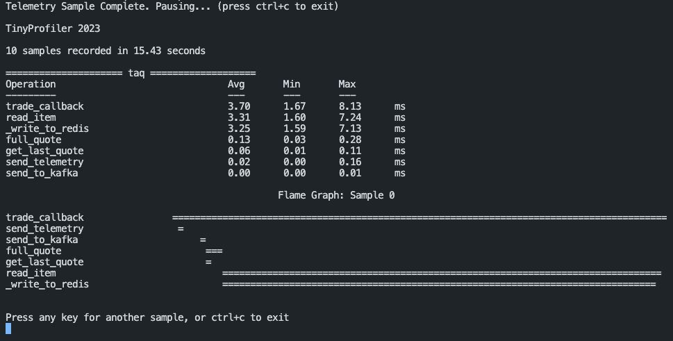

# tinyprofiler

Tiny Profiler is a sub 200 line profiling utility that records telemetry from your app,
provides metrics and a flame graph to help debug latency and throughput.

## Installation

`pip install tinyprofiler`

## Usage

```python3
from tinyprofiler import Observer

observer = Observer()

@observer.profile()
def your_function():
  # do something
```


